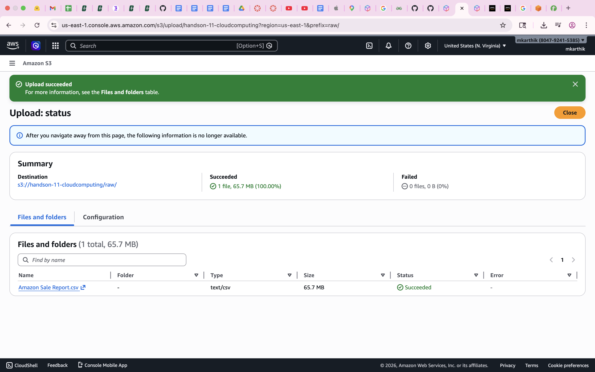
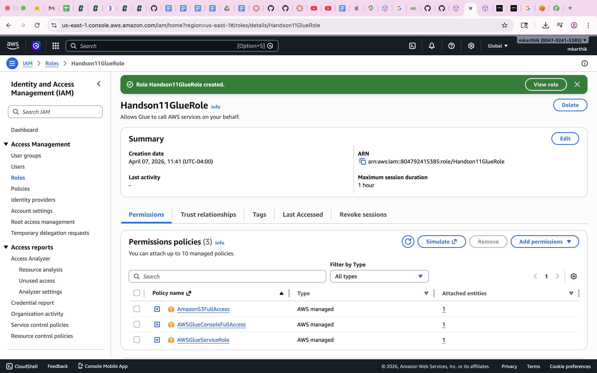
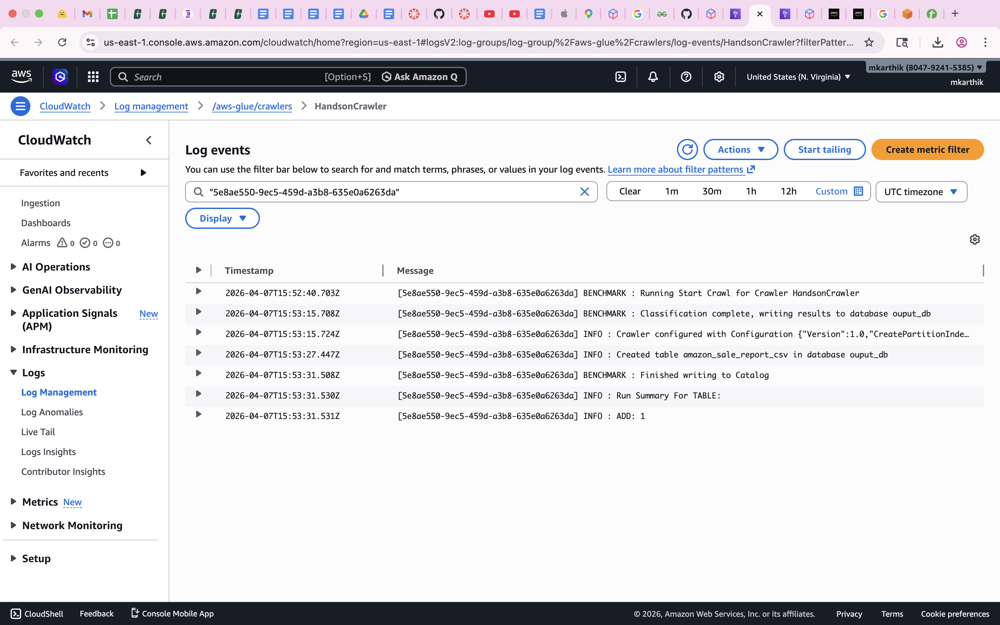

# Hands-on-11-AWS-Core-Services
In this hands-on, you will use AWS and work with a few fundamental services to query a database. 

Dataset: https://www.kaggle.com/datasets/thedevastator/unlock-profits-with-e-commerce-sales-data

Queries to Run in Athena (Apply limit condition to 10 for all queries):

- Query 1 — Basic Table Exploration: Write a query that retrieves the first 10 records 

- Query 2 — Orders by Product Category: Write a query that returns count of each product category along with the total number of orders placed in that category.

- Query 3 — Revenue and Quantity by Fulfilment Method: Write a query that returns each fulfilment method with its total number of orders, total units sold, and total revenue — excluding cancelled and pending orders — sorted by highest revenue first.

- Query 4 — Monthly Sales Trend: Write a query that returns each month along with the total number of orders and total revenue generated in that month, excluding cancelled and pending orders, sorted chronologically from earliest to latest.

- Query 5 — Top 5 Best-Selling SKUs per Category: Write a query that returns the top 5 SKUs in each product category ranked by total revenue, showing the category, SKU, total revenue, total units sold, and rank — excluding cancelled, pending, and zero-quantity orders.

## Explanations

Amazon S3 (Simple Storage Service) provides object storage for files (images, videos, backups). It allows you to store and retrieve any amount of data from anywhere on the web. IAM (identity management) provides security in the cloud. Glue crawler is a serverless, automated tool that scans data stores (such as S3) to infer schemas, detect data formats, and create/update metadata tables in the AWS Glue Data Catalog. CloudWatch is a monitoring and observability service for AWS resources and applications, providing real-time metrics, logs, and alarms to improve operational performance. It enables tracking resource utilization, visualizing data via dashboards, setting automated actions, and analyzing logs to troubleshoot issues. Athena is a serverless, interactive query service that allows you to analyze data directly in Amazon S3 using standard SQL

## Approach
1. Create an S3 Bucket
2. Load a CSV file into S3
3. Create a new IAM Role
4. Create a Glue crawler to crawl raw data
5. Run the crawler and open CloudWatch to monitor its status
6. Use Athena to query the crawled database
## Screenshots

### S3:

### IAM Role:

### CloudWatch:

